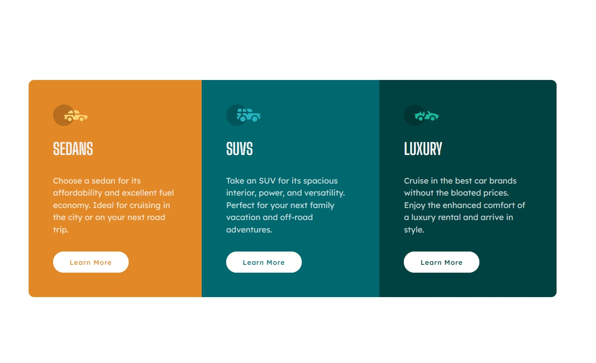

# Frontend Mentor - 3-column preview card component solution

This is a solution to the [3-column preview card component challenge on Frontend Mentor](https://www.frontendmentor.io/challenges/3column-preview-card-component-pH92eAR2-). Frontend Mentor challenges help you improve your coding skills by building realistic projects. 

## Table of contents

- [Overview](#overview)
  - [The challenge](#the-challenge)
  - [Screenshot](#screenshot)
  - [Links](#links)
- [My process](#my-process)
  - [Built with](#built-with)
  - [What I learned](#what-i-learned)
  - [Continued development](#continued-development)
  - [Useful resources](#useful-resources)
- [Author](#author)
- [Acknowledgments](#acknowledgments)

**Note: Delete this note and update the table of contents based on what sections you keep.**

## Overview

### The challenge

Users should be able to:

- View the optimal layout depending on their device's screen size
- See hover states for interactive elements

### Screenshot

### Links

- Solution URL: [Add solution URL here](https://your-solution-url.com)
- Live Site URL: [Add live site URL here](https://your-live-site-url.com)

## My process

### Built with

- Semantic HTML5 markup
- CSS custom properties
- Flexbox
- Mobile-first workflow

## What I learned

Practice indeed does make better. Perfect doesn't exist in the world of CSS.

### Continued development

I want to impoved on CSS properties like min, max and clamp. Still yet to get my way around them.
I also want to effectively apply the DRY principle.A lot of my code is redundant.

### Useful resources

- [Dev.to](https://dev.to/nazanin_ashrafi/how-to-stop-a-link-button-from-moving-on-hover-1c4) - This helped me figure out why buttons move when they are hovered on.

## Author

- Frontend Mentor - [@quenyoni](https://www.frontendmentor.io/profile/quenyoni)
- Twitter - [@quenyoni](https://www.twitter.com/nguqobo)

## Acknowledgments

Thank you to everyone who put this challenge together. I am growing.
